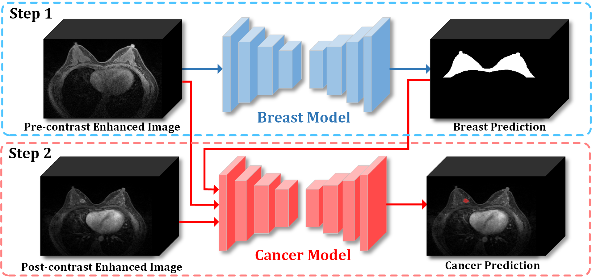

# Joint-phase Attention Network for Breast Cancer Segmentation in DCE-MRI
by [Rian Huang](https://github.com/ryandok), Zeyan Xu, Yu Xie, Hong Wu, Zixian Li, Yanfen Cui, Yingwen Huo, Chu Han, Xiaotang Yang*, Zaiyi Liu*, Yi Wang*


### Introduction

This repository is for our ESWA 2023 paper '[Joint-phase Attention Network for Breast Cancer Segmentation in DCE-MRI](https://www.sciencedirect.com/science/article/pii/S0957417423004645)'. 




### Installation
This repository is based on PyTorch 1.7.1.


### Usage

1. Clone the repository:
   ```shell
   git clone https://github.com/ryandok/JPA.git
   cd JPA
   ```
2. Preprocess data including `CropZeroZone, Resample, Normalization` on `C1, C0, BreastPred` of the input.
Reference: [nnUNet](https://github.com/MIC-DKFZ/nnUNet)

   
3. Internal structure of `data` folders:
    ```text
    ${data}
       [RawData]
           [DCE-C0]
               - DCE-C0_0000000.nii.gz
               - DCE-C0_0000001.nii.gz
               ...
           [DCE-C1]
               - DCE-C1_0000000.nii.gz
               - DCE-C1_0000001.nii.gz
               ...
           [TumorMask]
               - TumorMask_0000000.nii.gz
               - TumorMask_0000001.nii.gz
               ...
       
       [Processed]
           [DCE-C0]
               - DCE-C0_0000000.nii.gz
               - DCE-C0_0000001.nii.gz
               ...
           [DCE-C1]
               - DCE-C1_0000000.nii.gz
               - DCE-C1_0000001.nii.gz
               ...
           [BreastPred]
               - BreastPred_0000000.nii.gz
               - BreastPred_0000001.nii.gz
               ...
           [TumorMask]
               - TumorMask_0000000.nii.gz
               - TumorMask_0000001.nii.gz
               ...
           
    ```
   
4. Train the model:
   ```shell
   cd code
   python train_JPAnet_3channels_C1&C0&Breast.py --gpu 0 --data_root_path YOUR_PROCESSED_DATA --img1_prefix=DCE-C1 --img2_prefix=DCE-C0 --img3_prefix=BreastPred --label_prefix=TumorMask
   ```

5. Test the model:
   ```text
   modified 
   'utils.image_processing_breastSeg.ImageProcessingBreastSeg' and
   'utils.image_processing_tumorSeg.ImageProcessingTumorSegOriginRegion'
   according to your preprocess methods.
    ```
   
    ```shell
   cd code
   python test_TumorSeg_OriginRes_onBreastPred.py --gpu 0 --data_root_path YOUR_RAW_DATA --img1_prefix=DCE-C1 --img2_prefix=DCE-C0  --label_prefix=TumorMask --backbone=JPAnet_C1&C0&Breast --exp_name=YOUR_EXP_NAME
    ```
   


### Citation

If JPA is useful for your research, please consider citing:

    @article{huang2023joint,
        title={Joint-phase attention network for breast cancer segmentation in DCE-MRI},
        author={Huang, Rian and Xu, Zeyan and Xie, Yu and Wu, Hong and Li, Zixian and Cui, Yanfen and Huo, Yingwen and Han, Chu and Yang, Xiaotang and Liu, Zaiyi and others},
        journal={Expert Systems with Applications},
        pages={119962},
        year={2023},
        publisher={Elsevier}}


