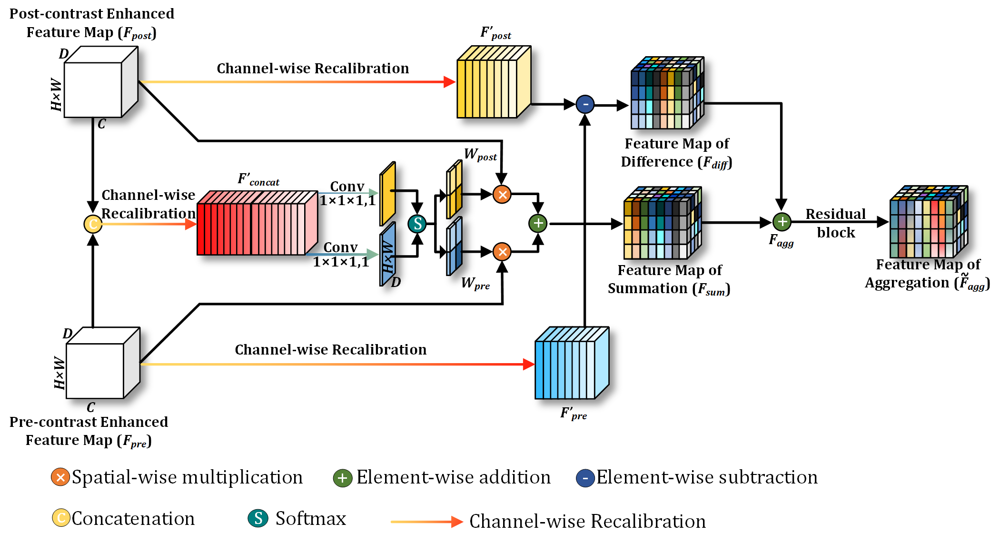

# Joint-phase Attention Network for Breast Cancer Segmentation in DCE-MRI
by [Rian Huang](https://github.com/ryandok), Zeyan Xu, Yu Xie, Hong Wu, Zixian Li, Yanfen Cui, Yingwen Huo, Chu Han, Xiaotang Yang*, Zaiyi Liu*, Yi Wang*


### Introduction

This repository is for our ESWA 2023 paper '[Joint-phase Attention Network for Breast Cancer Segmentation in DCE-MRI](https://arxiv.org/)'. (Accepted)





### Installation
This repository is based on PyTorch 1.7.1.


### Usage

1. Clone the repository:

   ```shell
   git clone https://github.com/ryandok/JPA.git
   cd JPA
   ```
2. Preprocess data including `CropZeroZone, Resample, Normalization`.
   
3. Train the model:
 
   ```shell
   cd code
   python train_JPAnet_3channels_C1&C0&Breast.py --gpu 0 --data_root_path YOUR_PROCESSED_DATA
   ```


### Citation

If JPA is useful for your research, please consider citing:

    TODO: add BibTex


### Note for data

TODO


